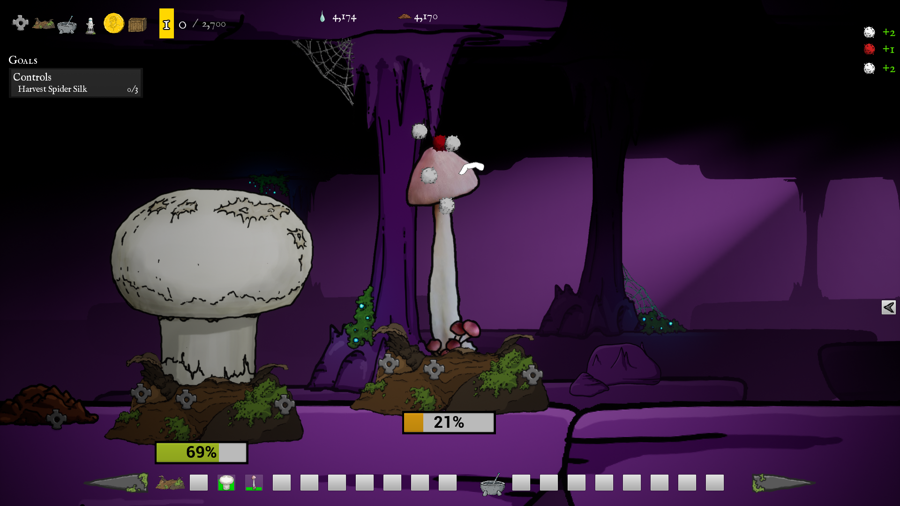
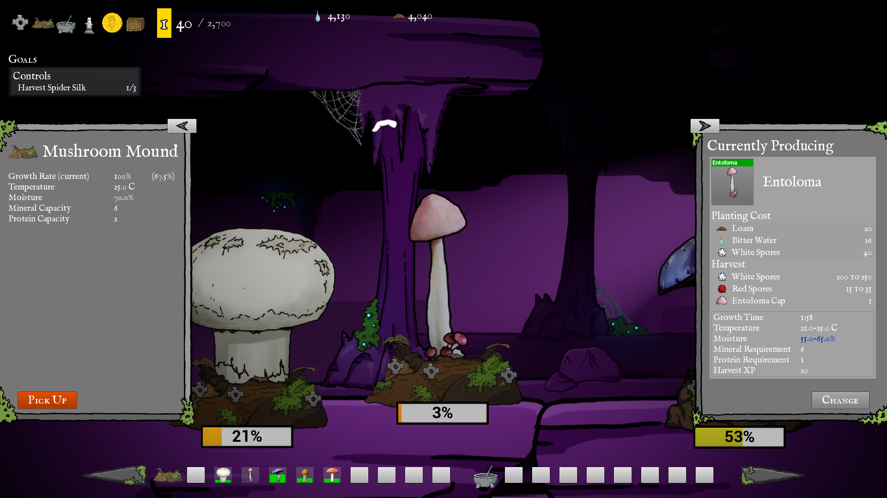
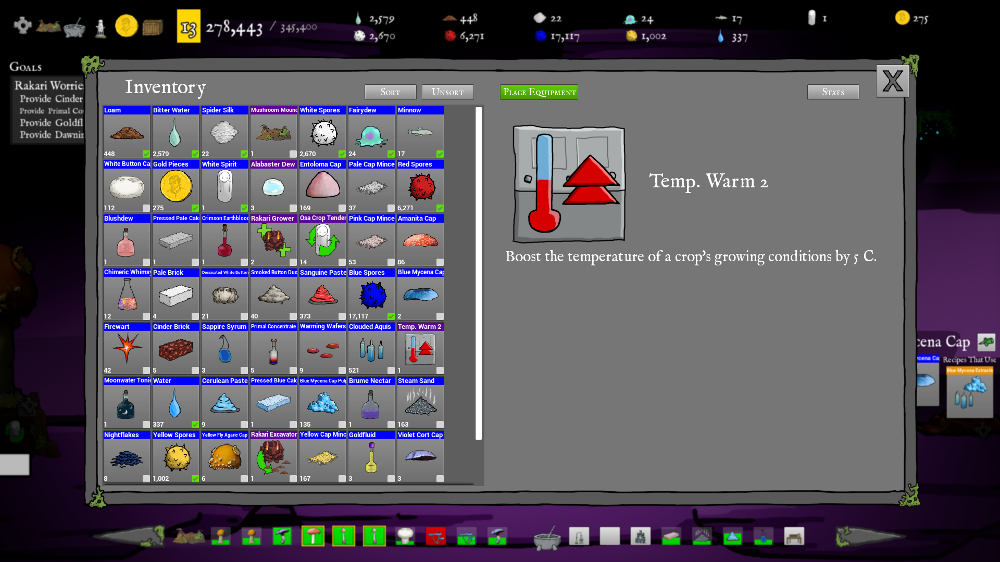
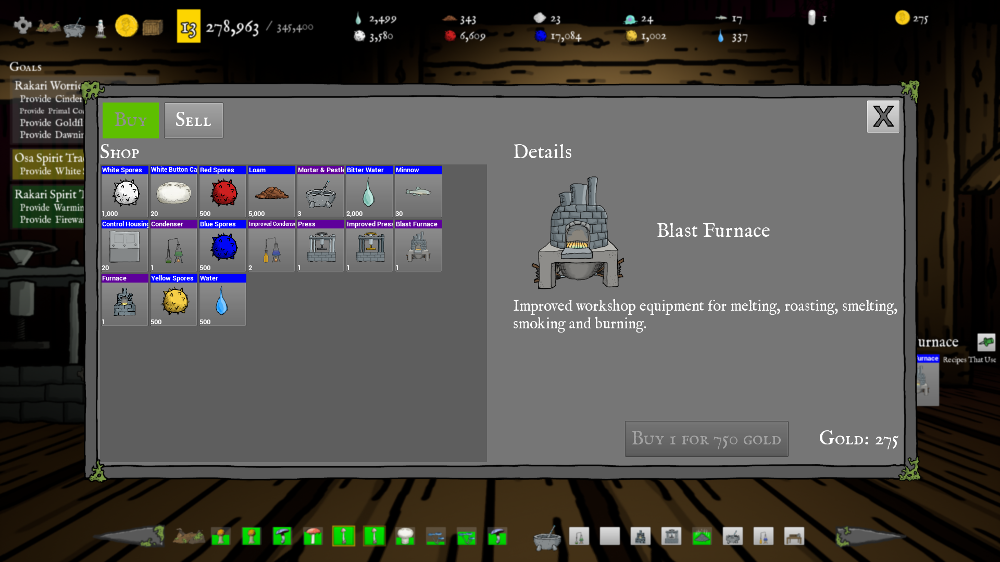
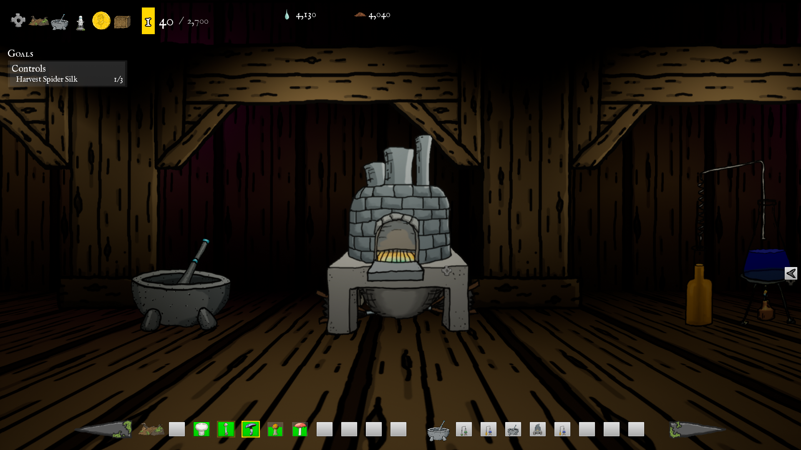
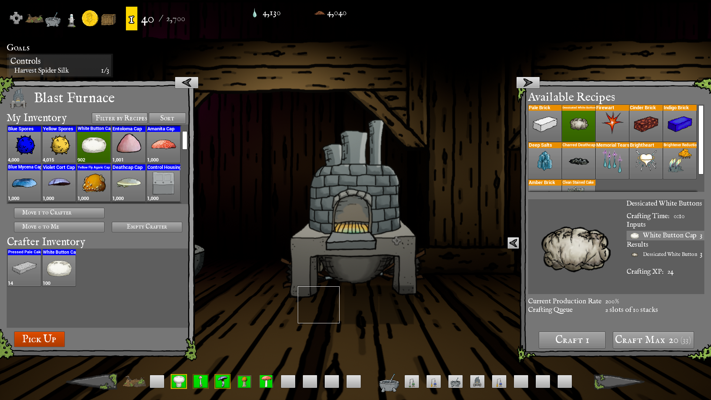
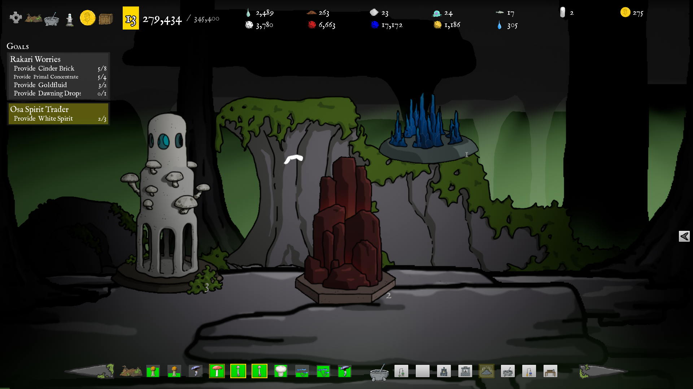

# Fungus Farm
UnrealEngine 4.25

Crafting / Clicker - grow crops, produce products in workshop crafting devices. 
7 types of fungal crops, 8 types of workshop equipment 
70+ craftable recipes, 80+ goods to produce and collect, 16 craftable equipment mods 
120+ scripted narrative goals over 10+ hours of gameplay. 

## Gameplay
As the player grows more crops and produces more goods, they are introduced to the various spirit tribes. 
These spirit tribes provide goals for the player as they unlock new fungi, new equipment and master new recipes. 
Along the way, the player will construct and upgrade spirit totems for each of the tribes, further increasing their production. 
These goods and recipes are needed by the spirits as a deep trouble is brewing in the spirit realm. 

## Study Project
This project is part of my learning process and serves to demonstrate familiarity with various concecpts including:
* Cpp and Blueprint Actor Components (inventory, attributes, etc.)
* Cpp gameplay goal provider components with data-table-driven goals and goal templates, built with cpp interfaces
* Cpp and Blueprint custom Modifiable Attributes system, built around cpp interface, supporting actor-specific and world-global modifiers.
* Cpp and Blueprint Modifier Equipment with data-table definable properties: scalar and multiplier attribute modifiers; constant, duration and event-triggered activation
* Cpp function library for simplifying inventory goods management: add, subtract, multiply goods quantities; evaluation of goods drop chances to produced goods, etc.

## Grow Fungi

## Crop Growing Conditions

## Player Inventory

## Buy and Sell in the Market

## Workshop Equipment

## Equipment Crafting

## Spirit Totems

